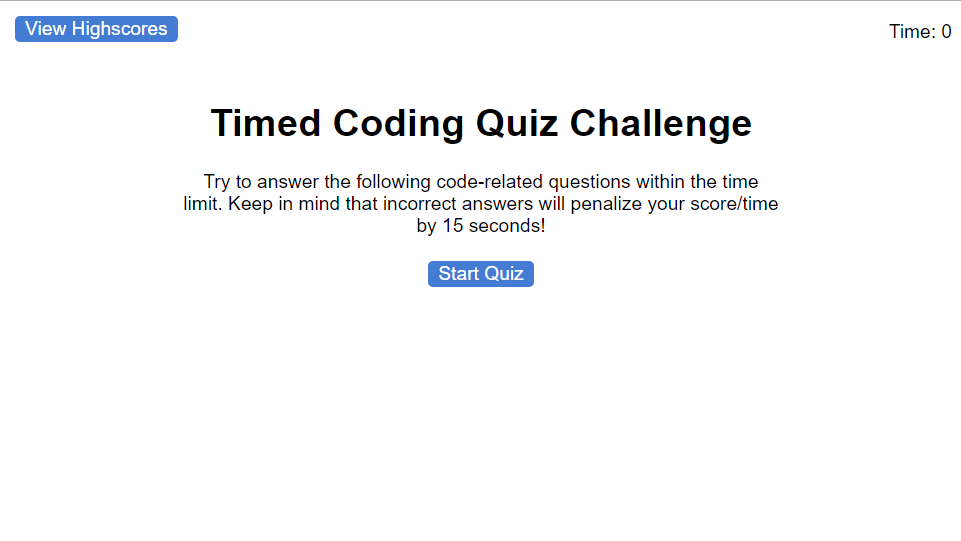

# Timed JavaScript Quiz

- [Deployment](#deployment)

## Description
This is a timed quix on JavaScript fundamentals. Within this quiz, you will be able to record your scores and compare it to others. 

## Demo

### Credits
[JavaScript Interview Questions](https://www.interviewbit.com/javascript-interview-questions/)

[MDN Web Docs - DOMContentLoaded event](https://developer.mozilla.org/en-US/docs/Web/API/Document/DOMContentLoaded_event)

[Charlotte BootCamp - Challenge 4 ](https://git.bootcampcontent.com/UNC-Charlotte/UNCC-VIRT-FSF-PT-07-2023-U-LOLC/-/tree/main/04-Web-APIs?ref_type=heads)

## Deployment

[GitHub Repository](https://github.com/Develepor-Dan/Timed_Quiz)

[Timed Coding Quiz]()